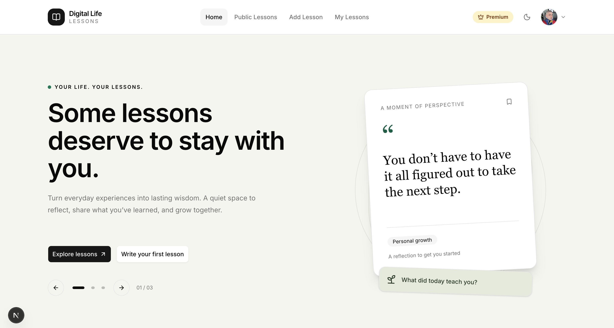
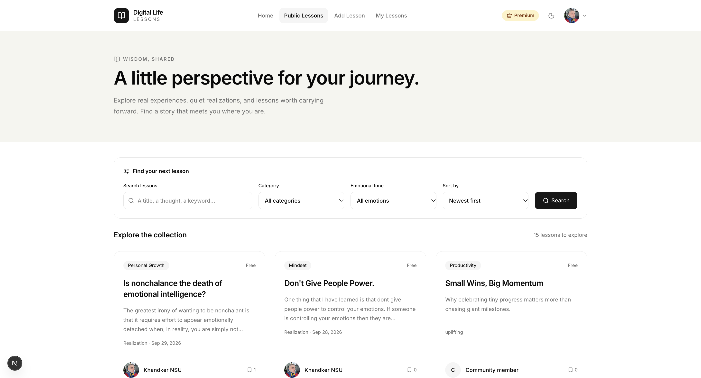
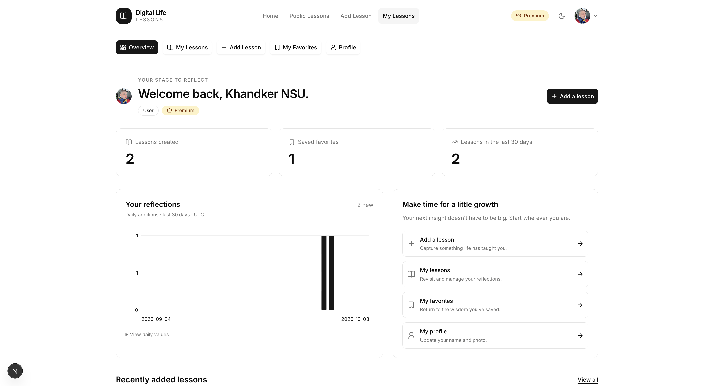
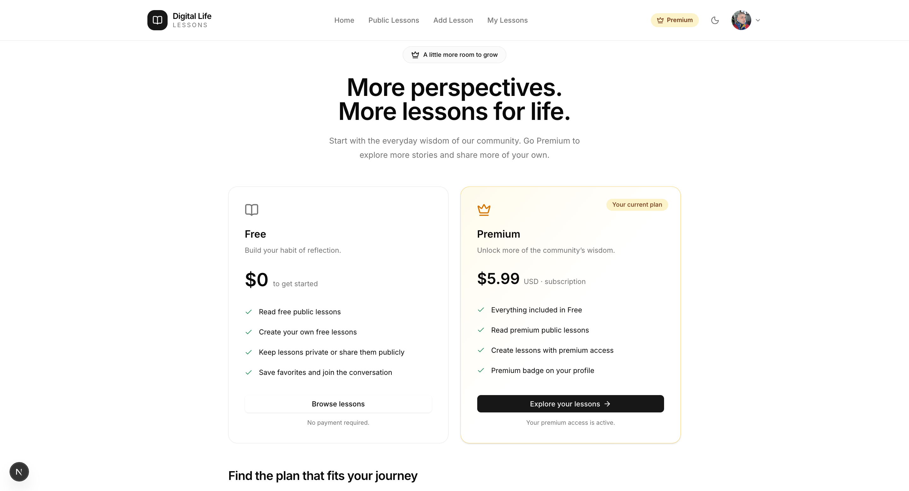
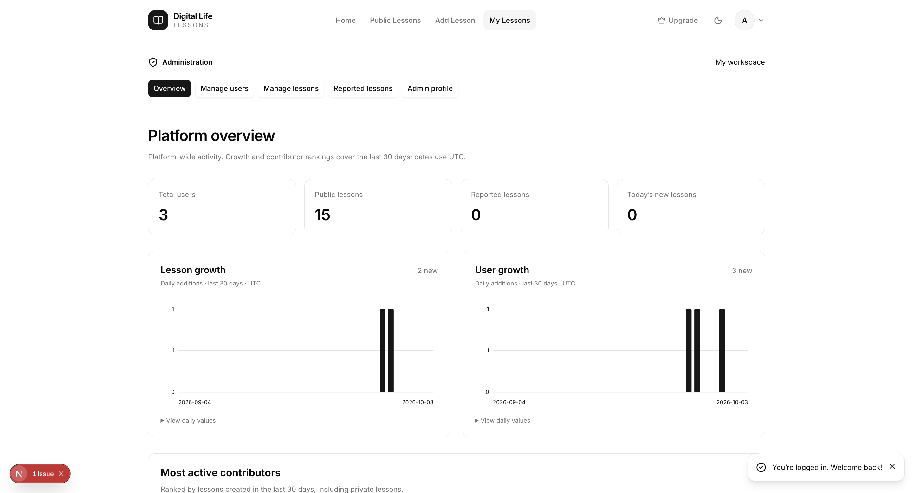

# Digital Life Lessons

A full-stack platform for preserving personal wisdom, sharing meaningful experiences, and learning from a community. Users can write public or private lessons, save favorites, and unlock premium content through a Stripe subscription.

## Project links

Replace the placeholders below before submission.

| Link | URL |
| --- | --- |
| Live website | https://p-hero-a10.vercel.app/ |
| Live Express API | https://p-hero-a10-server.vercel.app/ |
| Client repository | https://github.com/khandker-shathil/p-hero-a10 |
| Server repository | https://github.com/khandker-shathil/p-hero-a10-server |

## Screenshots

Save screenshots in [`docs/screenshots/`](docs/screenshots/). Use the filenames below, then uncomment the matching Markdown image lines in this README. Instructions are in [the screenshot guide](docs/screenshots/README.md).

<!-- Add each image file before uncommenting its line. -->






<!--  -->

## Key features

- **Authentication:** Better Auth email/password and Google login, protected dashboards, and role-based admin access.
- **Homepage:** three-slide hero, Motion animation, admin-selected featured lessons, weekly contributors, and most-saved lessons.
- **Discover lessons:** keyword search, category and emotional-tone filters, newest/most-saved sorting, and pagination.
- **Create and manage:** lesson creation, editing, deletion, public/private visibility, and Free/Premium access levels.
- **Engagement:** likes, favorites, comments, and lesson reports.
- **User dashboard:** personal lesson/favorite counts, five recent lessons, quick shortcuts, and a 30-day contribution chart.
- **Profiles:** display-name and photo updates, role and Premium badges, and public lesson history.
- **Premium:** $5.99 USD subscription checkout through Stripe, payment confirmation, checkout cancellation page, and verified MongoDB activation.
- **Admin tools:** platform analytics, user promotion, lesson filtering, featured/reviewed controls, and grouped report moderation.
- **Image uploads:** ImgBB hosting with browser compression and before/after file-size feedback.
- **Sharing:** Facebook, X, and LinkedIn through `react-share`, plus Copy link.
- **PDF export:** a clean lesson print layout with the browser’s **Save as PDF** option.
- **Interface:** light/dark theme, responsive layouts, toast feedback, loading states, and a custom 404 page.

## Technology and npm packages

| Area | Technologies/packages |
| --- | --- |
| Frontend | Next.js, React, JavaScript |
| Styling and UI | Tailwind CSS, shadcn/ui, `@base-ui/react`, `lucide-react`, `class-variance-authority` |
| Animation and theme | `motion`, `next-themes` |
| Authentication | `better-auth`, MongoDB adapter |
| Payments | `stripe`; `@stripe/stripe-js` is also installed |
| Image compression | `browser-image-compression` |
| Social sharing | `react-share` |
| Backend | Express, MongoDB driver, `cors`, `dotenv` |
| Development | ESLint, Prettier, Node.js test runner |

## Architecture

This repository contains the Next.js application. The separate Express project is expected at `../p-hero-a10-server` during local development.

- Express owns Better Auth, MongoDB, lesson APIs, admin APIs, image uploads, Premium activation, and Stripe webhooks.
- Next.js forwards `/api/*` requests to Express, except the local `/api/checkout_sessions` route, which creates Stripe Checkout sessions.
- The payment success page verifies checkout server-side and asks Express to activate the authenticated account.
- The API proxy keeps browser authentication cookies on the frontend origin.
- MongoDB’s Better Auth account collection is named `user`; application collections include `lessons`, `favorites`, `comments`, and `lessonsReports`.

## Run locally

Use **Node.js 24**. Clone both repositories into sibling folders named `p-hero-a10` and `p-hero-a10-server`, or adjust the paths below.

1. Create a `.env` file in each project using the configuration examples below. Keep actual secrets out of Git.
2. Start Express in one terminal:

   ```bash
   cd ../p-hero-a10-server
   nvm use
   npm ci
   npm run dev
   ```

3. Start Next.js in another terminal:

   ```bash
   cd p-hero-a10
   nvm use
   npm ci
   npm run dev
   ```

4. Open `http://localhost:3000`. The API normally runs on `http://localhost:5005`.

If you are already inside the client folder, omit `cd p-hero-a10` in step 3. Restart the relevant process after changing its environment variables.

## Environment variables — add your values here

The following are templates, not working credentials. Replace each `YOUR_...` value in your local `.env` or deployment environment settings. Never paste real secret values into this README.

### Next.js project: `.env`

```dotenv
API_SERVER_URL=http://localhost:5005
BILLING_SECRET_KEY=YOUR_STRIPE_SECRET_KEY
STRIPE_PRICE_ID=YOUR_RECURRING_STRIPE_PRICE_ID
NEXT_PUBLIC_BILLING_PUBLISHABLE_KEY=YOUR_STRIPE_PUBLISHABLE_KEY
```

- `API_SERVER_URL`: the Express origin, without `/api` at the end.
- `BILLING_SECRET_KEY`: server-only Stripe secret for creating and verifying checkout sessions. Never give this variable a `NEXT_PUBLIC_` prefix.
- `STRIPE_PRICE_ID`: the recurring Premium Price configured in Stripe. The checkout amount and billing interval come from this Price; keep it consistent with the pricing page.
- `NEXT_PUBLIC_BILLING_PUBLISHABLE_KEY`: public Stripe key. The current redirect-based checkout does not require it, but it is available for browser Stripe SDK use.

### Express project: `.env`

```dotenv
PORT=5005
CLIENT_URL=http://localhost:3000
BETTER_AUTH_URL=http://localhost:3000
BETTER_AUTH_SECRET=YOUR_LONG_RANDOM_AUTH_SECRET
MONGODB_URI=YOUR_MONGODB_CONNECTION_STRING
MONGODB_DB_NAME=digital-life-lesson
GOOGLE_CLIENT_ID=YOUR_GOOGLE_CLIENT_ID
GOOGLE_CLIENT_SECRET=YOUR_GOOGLE_CLIENT_SECRET
IMGBB_API_KEY=YOUR_IMGBB_API_KEY
BILLING_SECRET_KEY=YOUR_STRIPE_SECRET_KEY
STRIPE_PRICE_ID=YOUR_RECURRING_STRIPE_PRICE_ID
STRIPE_WEBHOOK_SECRET=YOUR_STRIPE_WEBHOOK_SIGNING_SECRET
```

- `CLIENT_URL`: the frontend origin, including `http://` or `https://`.
- `BETTER_AUTH_URL`: the frontend origin in this project’s same-origin API proxy setup.
- `MONGODB_DB_NAME`: change this value to use a custom database name.
- Google credentials enable Google sign-in. Configure the callback URL as `YOUR_FRONTEND_URL/api/auth/callback/google` in Google’s OAuth settings.
- `IMGBB_API_KEY`: stays on Express; MongoDB stores image URLs, not uploaded image files.
- Both projects must use Stripe secret keys for the same account/mode and the same `STRIPE_PRICE_ID`.
- `STRIPE_WEBHOOK_SECRET`: the signing secret for your configured webhook endpoint, not the Stripe API secret.

## Stripe setup and payment flow

1. Create a recurring **$5.99 USD** Price in Stripe test mode and add its ID as `STRIPE_PRICE_ID` in both projects.
2. Add `BILLING_SECRET_KEY` to both projects.
3. Create a Stripe webhook endpoint targeting `YOUR_LIVE_SERVER_URL/api/stripe/webhook`.
4. Subscribe to these events:
   - `checkout.session.completed`
   - `checkout.session.async_payment_succeeded`
   - `customer.subscription.updated`
   - `customer.subscription.deleted`
5. Add that endpoint’s signing secret to Express as `STRIPE_WEBHOOK_SECRET`.
6. Restart/redeploy both projects, then verify the flow using Stripe test mode.

Checkout attaches the authenticated user ID to the session and subscription. Express verifies account ownership, payment completion, the Premium Price, and subscription status before setting `user.isPremium` to `true`. It also stores the Stripe customer/subscription IDs and subscription status. The browser refreshes its session after activation.

Subscription webhooks synchronize access with Stripe’s current status. Canceling at period end retains access while the subscription remains active. Returning from checkout without completing it leads to `/payment/cancel`; this does not cancel an existing subscription.

Older checkouts created without user metadata require manual account matching after payment verification. Do not pay again just to link an older checkout.

## Main routes

| Route | Purpose |
| --- | --- |
| `/` | Homepage |
| `/login`, `/register` | Authentication |
| `/public-lessons` | Public lesson browsing |
| `/lessons/[id]` | Lesson details; free public lessons allow guest reading |
| `/authors/[id]` | Public author profile |
| `/pricing` | Plan comparison and authenticated checkout |
| `/pricing/success` | Verified checkout confirmation and Premium activation |
| `/payment/cancel` | Checkout cancellation page |
| `/dashboard` | Protected user overview |
| `/dashboard/add-lesson` | Create a lesson |
| `/dashboard/my-lessons` | Manage owned lessons |
| `/dashboard/update-lesson/[id]` | Edit a lesson |
| `/dashboard/my-favorites` | Saved lessons |
| `/dashboard/profile` | Profile settings and public lesson history |
| `/dashboard/admin` | Admin analytics |
| `/dashboard/admin/manage-users` | User table and promotion |
| `/dashboard/admin/manage-lessons` | Lesson moderation and filters |
| `/dashboard/admin/reported-lessons` | Report reasons, reporters, Delete/Ignore actions |
| `/dashboard/admin/profile` | Admin profile settings |

Private APIs verify Better Auth sessions. Admin APIs additionally check the current MongoDB role. Lesson ownership and access rules are enforced by Express.

## Image uploads and PDF export

- Upload JPEG, PNG, WebP, or GIF files up to **5 MB**.
- Profile photos target **200 KB / 512 px**; lesson images target **1 MB / 1920 px** before upload. These are compression targets, not guaranteed sizes.
- GIFs are preserved. The original file is kept if compression would make it larger.
- Removing an image removes its app reference, not the file from ImgBB.
- **Export PDF** opens a text-only print layout. Select **Save as PDF**. The export includes title, author, date, categories, access labels, and full lesson text; images and comments are excluded.

## Checks

Run in the client project:

```bash
npm run lint
node --experimental-test-module-mocks --test tests/*.test.mjs
npm run build -- --webpack
```

Run in the server project:

```bash
npm test
```

Some MongoDB aggregation tests are opt-in. The default tests mock payment/database writes; they do not replace a real browser checkout test.

## Deployment and submission — finish these items

- [ ] Replace the four `ADD_..._URL` placeholders at the top of this README.
- [ ] Add screenshots to `docs/screenshots/` and uncomment their image lines.
- [ ] Add the environment variables to the correct frontend/server deployment projects.
- [ ] Set frontend `API_SERVER_URL` to the deployed Express origin and rebuild.
- [ ] Set server `CLIENT_URL` and `BETTER_AUTH_URL` to the deployed frontend origin.
- [ ] Configure the production Google callback URL, MongoDB access, and Stripe webhook endpoint.
- [ ] Check `YOUR_LIVE_SERVER_URL/api/health` and verify frontend API requests.
- [ ] Test private-route reloads, login, uploads, lesson CRUD, and admin authorization.
- [ ] Test checkout, Premium activation, the Premium badge, and checkout cancellation.
- [ ] Test subscription lifecycle updates through signed Stripe webhooks.
- [ ] Check mobile, tablet, desktop, and both themes.
- [ ] Confirm at least **20 meaningful client commits** and **12 meaningful server commits**.

### Remaining application work

- Add footer contact information, Terms & Conditions, and actual social-profile URLs.
- Protect the pricing page itself if following the assignment’s private-route rule; currently checkout requires login, but the comparison page is public.
- Optional account deletion and moderation activity summaries are not implemented.
